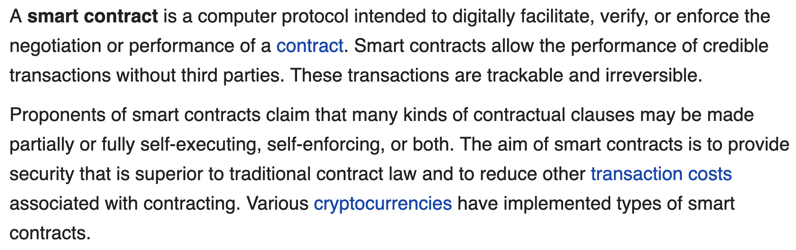
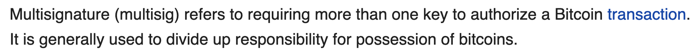
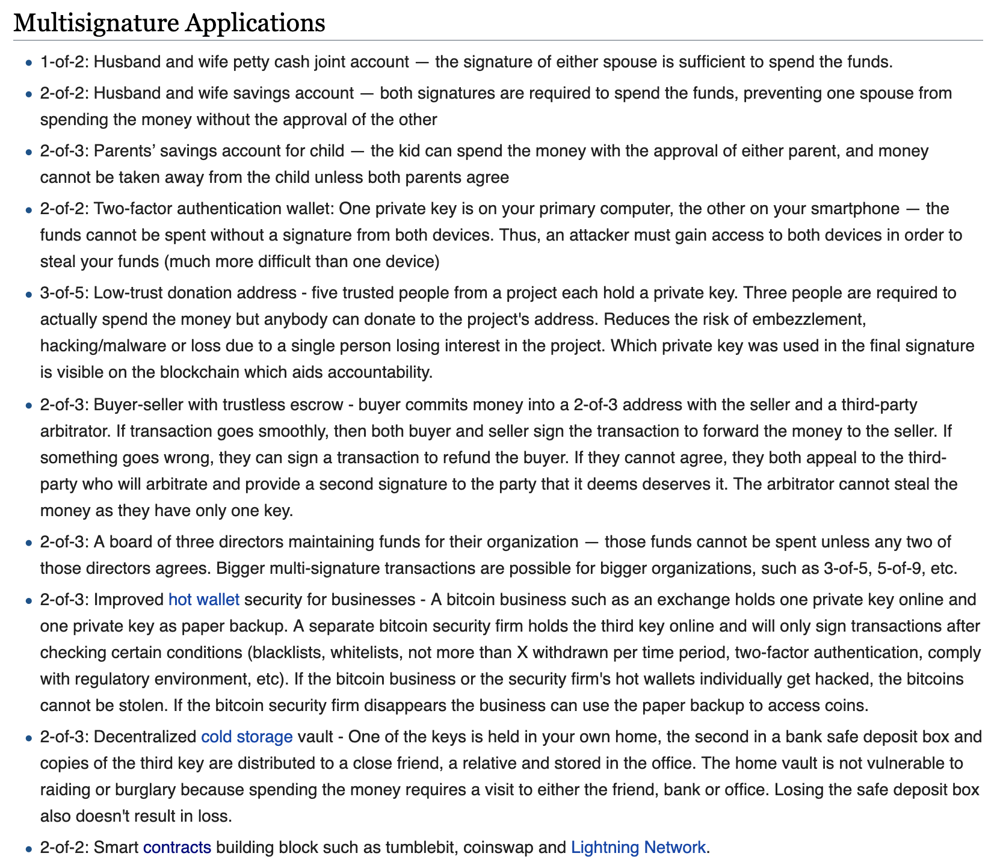
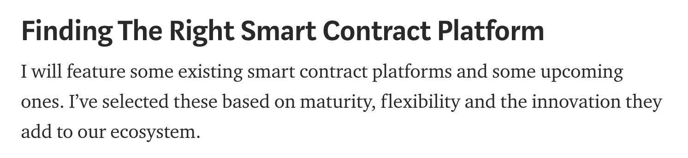
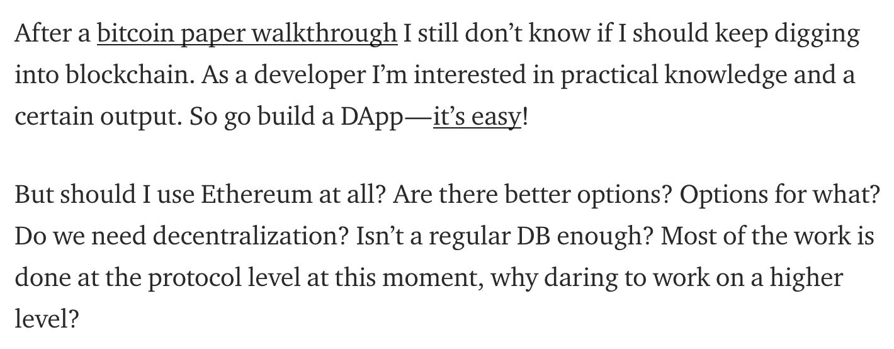
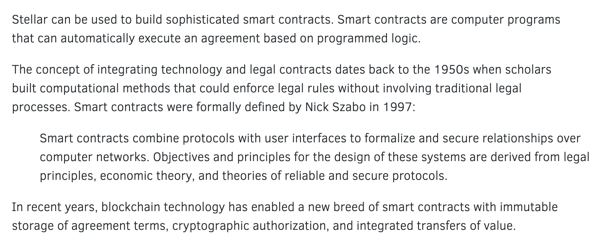

# Smart Contracts - A collection of articles and documentation to get started

### Contents
- [Resources](#resources)
- [Articles](#articles)
- [Official Documentation](#official-documentation)

## Resources

#### [What is a Smart Contract](https://en.m.wikipedia.org/wiki/Smart_contract)  
via [Wikipedia](https://en.wikipedia.org/)

#### [Bitcoin Multisig](https://en.bitcoin.it/wiki/Multisignature)  
via [Bitcoin Wiki](https://en.bitcoin.it/)

## Articles

#### [Comparison of Smart Contract Platforms](https://hackernoon.com/comparison-of-smart-contract-platforms-2796e34673b7)  
via [Michiel Mulders](https://hackernoon.com/@michielmulders)

#### [Should I develop for blockchain?](https://medium.com/coinmonks/should-i-develop-for-blockchain-d3321a6faecd)  
via [Sava Gerov](https://medium.com/@sgerov)

#### [The Truth about Smart Contracts](https://medium.com/@jimmysong/the-truth-about-smart-contracts-ae825271811f)  
via [Jimmy Song](https://medium.com/@jimmysong)

## Official Documentation

#### [Stellar Smart Contracts](https://www.stellar.org/developers/guides/walkthroughs/stellar-smart-contracts.html)  
via [stellar.org](https://www.stellar.org)

